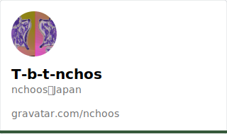

  

## ✨️| Self-introduction
### Hello, I'm T-b-t-nchos.
#### 🇯🇵 | Japanese
- はじめましての方ははじめまして、T-b-t-nchosです。
- 普段は学生をしています。
- C#などでちょっとしたアプリを開発してたりしてなかったりしています。 (公開する予定はありません)

#### 🇺🇸 | English
- Hello, I'm T-b-t-nchos.
- I'm a student.
- I sometimes work on small apps in C#.  (but I don’t plan to release them)

 

---

 

## 🔥| Skil...s?
### Core Languages..?

 

### Frameworks & Runtimes & Dlls

 

### OS

 

---

 

## 🔧| My project(?)s
### ✏️| Syobosetsu (Private)

  
<b>🤔| What's this?</b>

  <blockquote>
    C#で開発しているテキストエディタです。 
    ベースにはAzuki Text Editor Engineを採用し、日本語に対応しています。 
    主に小説など、文章を書くことに向いたアプリです。 
    なお、公開する予定はありません。 
     
    補足なのですが、某氏が元々開発したものを譲り受け、開発しています。(某氏も開発に参加しています) 
    後述のBad Apple!! on Excel...と同様の経緯です。
  </blockquote>

 

### 🍎| Bad Apple!! on Excel (RealTime) (Priva...te?)

  
<b>🤔| What's this?</b>

  <blockquote>
    Excel上でBad Apple!!の影絵動画を描画するプログラムを、某氏と共同開発しました。 
    ネットの海の何処かにある、Bad Apple!!のリアルタイムExcel描画、もしかしたら私が関わったもの"かも"...? 
     
    補足なのですが、元々のアイデアは某氏のものです。 
    某氏(アイデア,開発)→私(改善)→某氏(公開)です。 
  </blockquote>

 

\~ And, mo...re? \~

---

 

## 📊| Contributes

  <picture>
    <source media="(prefers-color-scheme: dark)" srcset="https://github-readme-stats-t-b-t-nchos.vercel.app/api?show_icons=true&count_private=true&username=T-b-t-nchos&bg_color=151b23&title_color=16a34a&text_color=d0d0d0&icon_color=16a34a&hide_border=true">
    <source media="(prefers-color-scheme: light)" srcset="https://github-readme-stats-t-b-t-nchos.vercel.app/api?show_icons=true&count_private=true&username=T-b-t-nchos&bg_color=f6f8fa&title_color=16a34a&text_color=6b7280&icon_color=16a34a&hide_border=true">
    
  </picture>
  <picture>
    <source media="(prefers-color-scheme: dark)" srcset="https://github-readme-stats-t-b-t-nchos.vercel.app/api/top-langs?show_icons=true&count_private=true&username=T-b-t-nchos&bg_color=151b23&title_color=16a34a&text_color=d0d0d0&icon_color=16a34a&hide_border=true">
    <source media="(prefers-color-scheme: light)" srcset="https://github-readme-stats-t-b-t-nchos.vercel.app/api/top-langs?show_icons=true&count_private=true&username=T-b-t-nchos&bg_color=f6f8fa&title_color=16a34a&text_color=6b7280&icon_color=16a34a&hide_border=true">
    
  </picture>

 

---

## ✒️| Gravator Profile

  

---

 

## 🪄| Asci-Art...?

  

  
<b>Here</b>

    
  </detail>

## 🐍| Contribute-Snake...

  <picture>
    <source media="(prefers-color-scheme: dark)" srcset="https://raw.githubusercontent.com/T-b-t-nchos/T-b-t-nchos/output/github-contribution-grid-snake-dark.svg">
    <source media="(prefers-color-scheme: light)" srcset="https://raw.githubusercontent.com/T-b-t-nchos/T-b-t-nchos/output/github-contribution-grid-snake.svg">
    
  </picture>

 

---

 

 

  
thanks for reading to here!

  

